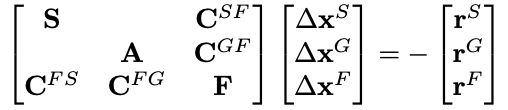

# Block preconditioning of monolithic FSI solvers

We now study two different multilevel block preconditioning approaches[^1] for monolithic fluid/solid interaction (FSI) solvers. As a test case, we use a pressure wave travelling through an elastic tube, which is often considered a standard benchmark for monolithic FSI solvers.

The arising linear system of equations exhibits $3x3$ block structure, reading[^1][^2]:



> Note that a software implementation of monolithic FSI might use a different ordering of the fields.

> Again, the exact details of the problem setup are not important for the course of this tutorial and, thus, are omitted for the sake of brevity.

The simulation model is defined using the following files:

- `pw.4C.yaml`: simulation parameters and boundary conditions for a pressure wave travelling through an elastic tube
- `gmres_fsi.xml`: definition of a GMRES solver from Belos (required for iterative solvers throughout the tutorial)
- `pw.exo`: mesh in binary format

Different preconditioners are predefined in the following files:

- `prec_fsi_teko_block_iterative.xml`
- `prec_fsi_muelu_fully_coupled_amg.xml`

They will be used and modified throughout this tutorial.

## Step 1: Block-Iterative Preconditioner

We first study a block-iterative preconditioner implemented via Teko[^3]. Its configuration is given in `prec_fsi_teko_block_iterative.xml`. It is defined as `SOLVER 2` in the input file and is activated by default.

1. Open `prec_fsi_teko_block_iterative.xml` and familiarize yourself with the file and its content.
   ><details>
   ><summary>Some background on the file structure for Teko preconditioners</summary>
   >
   >The list `Preconditioner` defines the overall layout of the block preconditioner:
   >
   >```xml
   ><ParameterList name="Preconditioner">
   >  <Parameter name="Type" type="string" value="Block Gauss-Seidel"/>
   >  <Parameter name="Use Upper Triangle" type="bool" value="false"/>
   >  <Parameter name="Inverse Type 1" type="string" value="Inverse1"/>
   >  <Parameter name="Inverse Type 2" type="string" value="Inverse2"/>
   >  <Parameter name="Inverse Type 3" type="string" value="Inverse3"/>
   ></ParameterList>
   >```
   >
   >In this case, it selects a `Block Gauss-Seidel` approach. Furthermore, it specifies names of lists (`Inverse1`, `Inverse2`, `Inverse3`) which provide details on how to approximate the necessary block inverses of the first, second, and third block within the 3x3 block system.
   >
   >Then, an approximate inversion of each block is specified in their own sublists. For the solid block (`Inverse1`), this reads:
   >
   >```xml
   ><!-- ===========  SINGLE FIELD PRECONDITIONER FOR SOLID ================ -->
   ><ParameterList name="Inverse1">
   >  <Parameter name="Type" type="string" value="MueLu"/>
   >  <Parameter name="multigrid algorithm" type="string" value="sa"/>
   >  <Parameter name="verbosity" type="string" value="None"/>
   >  <Parameter name="coarse: max size" type="int" value="200"/>
   >  <Parameter name="smoother: type" type="string" value="CHEBYSHEV"/>
   >  <ParameterList name="smoother: params">
   >    <Parameter name="chebyshev: degree" type="int" value="2"/>
   >    <Parameter name="chebyshev: min eigenvalue" type="double" value="1.0"/>
   >    <Parameter name="chebyshev: zero starting solution" type="bool" value="true"/>
   >  </ParameterList>
   ></ParameterList>
   >```
   >
   >It uses `MueLu` with an `sa` (smoothed aggregation) algebraic multigrid scheme and provides all other parameters to properly define a MueLu hierarchy. 
   >
   >**Note:** This part might look familiar, as it just resembles a "standard" MueLu xml file as you have already seen it in the first part of this tutorial, where we have used MueLu for a solid mechanics problem.
   >
   >Analogously, sublists `Inverse2` and `Inverse3` define approximate inversions for the fluid and ALE block, respectively.
   >
   ></details>
1. Run the example on two MPI processes via

   ```bash
   mpirun -np 2 <4Cexe> pw.4C.yaml output
   ```

1. Study the influence of the preconditioner configuration on the number of GMRES iterations and/or runtime  until convergence. Therefore, adapt the preconditioner settings in `prec_fsi_teko_block_iterative.xml`.

## Step 2: Fully coupled Preconditioner

Now, we switch to a fully coupled AMG preconditioner implemented in MueLu[^4]. Its configuration is given in `prec_fsi_muelu_fully_coupled_amg.xml`. It is defined as `SOLVER 3` in the input.

1. Open the input file `pw.4C.yaml`.
1. Find the section `FSI DYNAMIC/MONOLITHIC SOLVER` and set its parameter `LINEAR_SOLVER` to `3`.

To study the preconditioner, perform the following steps:

1. Open `prec_fsi_muelu_fully_coupled_amg.xml` and familiarize yourself with the file and its content.
   ><details>
   ><summary>Some background on the file structure for MueLu block preconditioners</summary>
   >
   > MueLu block preconditioners can be defined via MueLu's "advanced" input deck. This details all factories, i.e., building blocks of a multigrid hierarchy in sublists of the xml file. These are then processed by MueLu and stitched together to create a MueLu preconditioner.
   >
   >- The list `Factories` collects all individual factories. Factories can refer to other factories, e.g., for using the result of factory A as input for factory B. Therefore, factory A must be defined prior to factory B in the list of all factories. Other than that, the ordering of the factories is arbitrary. In this spirit, aggregation, transfer operators, or smoothers (or any other component of a MueLu hierarchy) are represented via their own sublist in the `Factories` list.
   >- The list `Hierarchy` defines the actual multigrid hiearchy based on some parameters and the factories from above.
   >
   ></details>
1. Run the example on two MPI processes via

   ```bash
   mpirun -np 2 <4Cexe> pw.4C.yaml output
   ```

1. Study the influence of the preconditioner configuration on the number of GMRES iterations and/or runtime  until convergence. Therefore, adapt the preconditioner settings in `prec_fsi_teko_block_iterative.xml`. You could change the following components of the preconditioner:

- Number of sweeps and damping parameter of the block Gauss-Seidel level smoother, cf. sublist `myBlockSmoother`
- Smoothers for solid, fluid, ale blocks, cf. `mySmooFact1`, `mySmooFact2`, `mySmooFact3`

Discuss the observations with your colleagues.

[^1]: M. W. Gee, U. Küttler, and W. A. Wall. Truly monolithic algebraic multigrid for fluid–structure interaction. International Journal for Numerical Methods in Engineering, 85(8):987–1016, 2011
[^2]: M. Mayr, T. Klöppel, W. A. Wall, and M. W. Gee. A Temporal Consistent Monolithic Approach to Fluid–Structure Interaction Enabling Single Field Predictors. SIAM Journal on Scientific Computing, 37(1):B30–B59, 2015
[^3]: E. C. Cyr, J. N. Shadid, and R. S. Tuminaro. Teko: A Block Preconditioning Capability with Concrete Example Applications in Navier–Stokes and MHD. SIAM Journal on Scientific Computing, 38(5):S307–S331, 2016
[^4]: L. Berger-Vergiat, C. A. Glusa, G. Harper, J. J. Hu, M. Mayr, A. Prokopenko, C. M. Siefert, R. S. Tuminaro, and T. A. Wiesner. MueLu User’s Guide. Technical Report SAND2023-12265, Sandia National Laboratories, Albuquerque, NM (USA) 87185, 2023
