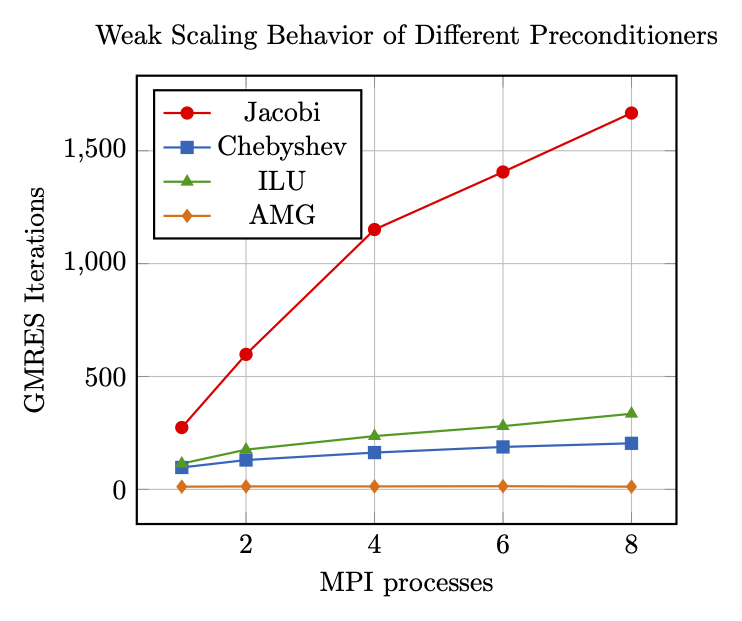
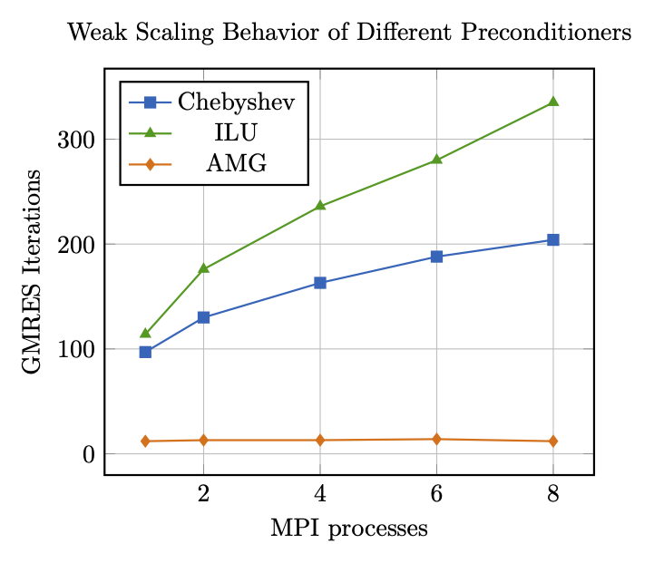

# Solving linear systems arising from 3D elasticity

The following instructions will guide you through different preconditioner options
to solve a linear system

$$Ax = b$$

arising from the finite element discretization of a cantilever beam using solid elements.

> The exact details of the problem setup are not important for the course of this tutorial
and, thus, are omitted for the sake of brevity.

The simulation model with three possible meshes is defined using the following files:

- `solid.4C.yaml`: simulation parameters and boundary conditions for clamped cantilever beam with endload performing a single solve of the linear sytem
- `gmres_solid.xml`: definition of a GMRES solver from Belos (required for iterative solvers throughout the tutorial)
- a series of mesh files `solid_*.exo` to change the size of the linear system to be solved (see table with meshing details)

Meshing details:

| Mesh file | #nodes x | #nodes y | #nodes z | #DOFs |  #MPI ranks |
|---|---|---|---|---|---|
| `solid_0.exo` | 3 | 3 | 15 | 405 | 1 |
| `solid_1.exo` | 12 | 12 | 60 | 25920 | 1 |
| `solid_2.exo` | 16 | 16 | 80 | 61440 | 2 |
| `solid_3.exo` | 20 | 20 | 100 | 120000 | 4 |
| `solid_4.exo` | 23 | 23 | 115 | 182505 | 6 |
| `solid_5.exo` | 25 | 25 |125 | 234375 | 8 |

Different preconditioners are predefined in the following files:

- `prec_solid_ifpack_Jacobi.xml`
- `prec_solid_ifpack_ILU.xml`
- `prec_solid_ifpack_GaussSeidel.xml`
- `prec_solid_muelu_sa_amg.xml`

They will be used and modified throughout this tutorial.

## Preliminary Steps

The default intput file comes with a direct solver, so you can run it right away.
To run it on `<numProc> MPI ranks, use the following command:

```bash
mpirun -np <numProcs> <4Cexe> solid.4C.yaml output
```

Please verify, that the simulation has finished successfully.

## Step 0: Iterative Solver without any Preconditioner

In theory, you can run a Krylov solver without any preconditioner and it will converge in $N$ iterations for a system with $N$ equations.
Since unpreconditioned Krylov solvers are know to deliver bad performance [^1], 4C does not offer this option,
and we also do not cover it in this tutorial.

## Step 1: Iterative Solver with Jacobi preconditioner

The `solid.4C.yaml` input file comes with a pre-configured iterative solver (GMRES) with a **relaxation preconditioner**, namely **Jacobi's method**.
In the input file, it is defined in `SOLVER 2`.
The preconditioner is configured in the file `prec_solid_Jacobi.xml`.

To switch to GMRES with a Jacobi preconditioner, set the solid `LINEAR_SOLVER` to `2`.

1. Open the `solid.4C.yaml` input file.
1. Familiarize yourself with the list `SOLVER 2` and the file `prec_solid_Jacobi.xml`.
1. To switch to the new solver,
   1. find the list `STRUCTURAL DYNAMIC`,
   1. modify the value of its parameter `LINEAR_SOLVER` to `2`.
1. Save the file `solid.4C.yaml`

<details>
<summary>Solution</summary>

```
STRUCTURAL DYNAMIC:
  INT_STRATEGY: "Standard"
  DYNAMICTYPE: "Statics"
  TIMESTEP: 1.0
  NUMSTEP: 1
  MAXTIME: 1
  MAXITER: 1
  DIVERCONT: "continue"
  LINEAR_SOLVER: 2
```

</details>

Now, run the example and watch the convergence behavior of the iterative solver.
Study the influence of the following parameters on the number of GMRES iterations and/or runtime  until convergence:

- Configuration of the preconditioner:

  - Number of sweeps: `"relaxation: sweeps"`
  - Number of sweeps: `"relaxation: damping factor"`

- Mesh (to be set in `solid.4C.yaml`)

  - `solid_1.exo` (for 1 MPI process)
  - `solid_2.exo` (for 2 MPI processes)
  - `solid_3.exo` (for 4 MPI processes)
  - `solid_4.exo` (for 6 MPI processes)
  - `solid_5.exo` (for 8 MPI processes)

Discuss the observations with your colleagues.

<details>
<summary>Expected outcome</summary>

- More sweeps reduce the number of iterations.
- Smaller damping values, i.e., more damping, increase the number of iterations.

</details>

## Step 2: Iterative Solver with Chebyshev preconditioner

The `solid.4C.yaml` input file comes with a pre-configured iterative solver (GMRES) with a **polynomial preconditioner** using **Chebyshev polynomials**.
In the input file, it is defined in `SOLVER 3`.
The preconditioner is configured in the file `prec_solid_chebyshev.xml`.

To switch to GMRES with a Chebyshev preconditioner, set the solid `LINEAR_SOLVER` to `3`.

<details>
<summary>Solution</summary>

```
STRUCTURAL DYNAMIC:
  INT_STRATEGY: "Standard"
  DYNAMICTYPE: "Statics"
  TIMESTEP: 1.0
  NUMSTEP: 1
  MAXTIME: 1
  MAXITER: 1
  DIVERCONT: "continue"
  LINEAR_SOLVER: 3
```

</details>

Now, run the example and watch the convergence behavior of the iterative solver.
Study the influence of the following parameters on the number of GMRES iterations and/or runtime  until convergence:

- Configuration of the preconditioner:

  - Polynomial degree: `"relaxation: sweeps"`

- Mesh (to be set in `solid.4C.yaml`)

  - `solid_1.exo` (for 1 MPI process)
  - `solid_2.exo` (for 2 MPI processes)
  - `solid_3.exo` (for 4 MPI processes)
  - `solid_4.exo` (for 6 MPI processes)
  - `solid_5.exo` (for 8 MPI processes)

Discuss the observations with your colleagues.

<details>
<summary>Expected outcome</summary>

Larger polynomial degrees reduce the number of iterations.

</details>

## Step 3: Iterative Solver with Incompluete-LU Factorization Preconditioner

The `solid.4C.yaml` input file comes with a pre-configured iterative solver (GMRES) with an **incomplete LU factorization (ILU) preconditioner**.
In the input file, it is defined in `SOLVER 4`.
The preconditioner is configured in the file `prec_solid_ifpack_ILU.xml`.

To switch to GMRES with an ILU preconditioner, set the solid `LINEAR_SOLVER` to `4`.

<details>
<summary>Solution</summary>

```
STRUCTURAL DYNAMIC:
  INT_STRATEGY: "Standard"
  DYNAMICTYPE: "Statics"
  TIMESTEP: 1.0
  NUMSTEP: 1
  MAXTIME: 1
  MAXITER: 1
  DIVERCONT: "continue"
  LINEAR_SOLVER: 4
```

</details>

Now, run the example and watch the convergence behavior of the iterative solver.
Study the influence of the following parameters on the number of GMRES iterations and/or runtime until convergence:

- Configuration of the preconditioner:

  - Overlap at processor boundaries: `"Overlap"` defines the overlap at processor boundaries (`0` = no overlap, larger values results in larger overlap)
  - Fill-in: `"fact: level-of-fill"` defines the allowed fill-in (larger values result in a better approximation, however a more expensice setup procedure)

- Mesh (to be set in `solid.4C.yaml`)

  - `solid_1.exo` (for 1 MPI process)
  - `solid_2.exo` (for 2 MPI processes)
  - `solid_3.exo` (for 4 MPI processes)
  - `solid_4.exo` (for 6 MPI processes)
  - `solid_5.exo` (for 8 MPI processes)

Discuss the observations with your colleagues.

<details>
<summary>Expected outcome</summary>

Larger fill-in reduces the number of iterations, but increases the preconditioner setup time.

</details>

## Step 4: Iterative Solver with Smoothed-Aggregation Algebraic Multigrid Preconditioner

## Step 5: Weak Scaling Behavior

We now compare the weak scaling behavior of the different preconditioners.
Due to its practival relevance, we study _weak scaling behavior_ [^2],
i.e., we increase the problem size at the same rate as the computing resources
yielding a constant load (number of unknowns) per MPI process
and expect a constant performance of the iterative solver.

For the purpose of this tutorial,
we assess the performance by the number of GMRES iterations required to reach convergence.
For simplicity, we refrain from assessing timings in this tutorial.

To assess the weak scaling behavior of a particular preconditioner, perform the following steps:

1. Select a preconditioner by choosing one of the predefined `SOLVER`s in `solid.4C.yaml`.
   1. Choose a parametrization for this preconditioner in the respective `prec_solid_*.xml` file
(and keep it constant for the entire study)
   1. Study one mesh
      1. Select a mesh by setting `solid_*.exo` in the input file.
      1. Run the example using the suitable number of MPI processes (as listed in the tables on meshing details)
      1. Take a note of the number of GMRES iterations reqired to reach convergence
   1. Study the next mesh (i.e., repeat step 3 with another mesh until all meshes have been computed.)
1. Go to step 1 and select a different preconditioner

> Make sure to at least cover one of the preconditioners from Ifpack and the multigrid preconditioner from MueLu.

Think about this:

- How does the iteration number behave for a growing number of MPI processes and unknowns?
- What is the main difference between the multigrid preconditioner and all the other one-level preconditioners?

Discuss your finding with your colleagues.

<details>
<summary>Comparison of Weak Scaling Behavior</summary>

The weak scaling behavior of the following preconditioners is compared:

- Jacobi: 1 sweep with damping 1.0
- Chebyshev: polynomial degree 3
- ILU: fill-level 0
- SA-AMG: V-cycle with Chebyshev polynomials of degree 2 as level smoothers

To make it reproducible on a laptop or desktop workstation,
scaling behavior is assess for 1, 2, 4, 6, and 8 MPI processes only.
The number of iterations for each mesh and preconditioner are reported in the following figure:



For a less distored diagram, here is a plot of the same data without the Jacobi preconditioner:



Here are the numbers in detail:

| Procs      | 1   | 2   | 4    | 6    | 8    |
|------------|-----|-----|------|------|------|
| Jacobi     | 274 | 598 | 1151 | 1406 | 1667 |
| Chebyshev  | 97  | 130 | 163  | 188  | 204  |
| ILU        | 114 | 176 | 236  | 280  | 335  |
| AMG        | 12  | 13  | 13   | 14   | 12   |

It can clearly be seen, that

1. the multigrid preconditioner outperforms all other methods by far
1. the multigrid preconditioner is the only preconditioner with optimal weak scaling, i.e., the only one that delivers iteration numbers independent of the problem size.

</details>

[^1]: Y. Saad. Iterative Methods for Sparse Linear Systems. SIAM, Philadelphia, PA, USA, 2003
[^2]: J. L. Gustafson. Reevaluating Amdahl’s law. Communications of the ACM, 31(5):532–533, 1988
